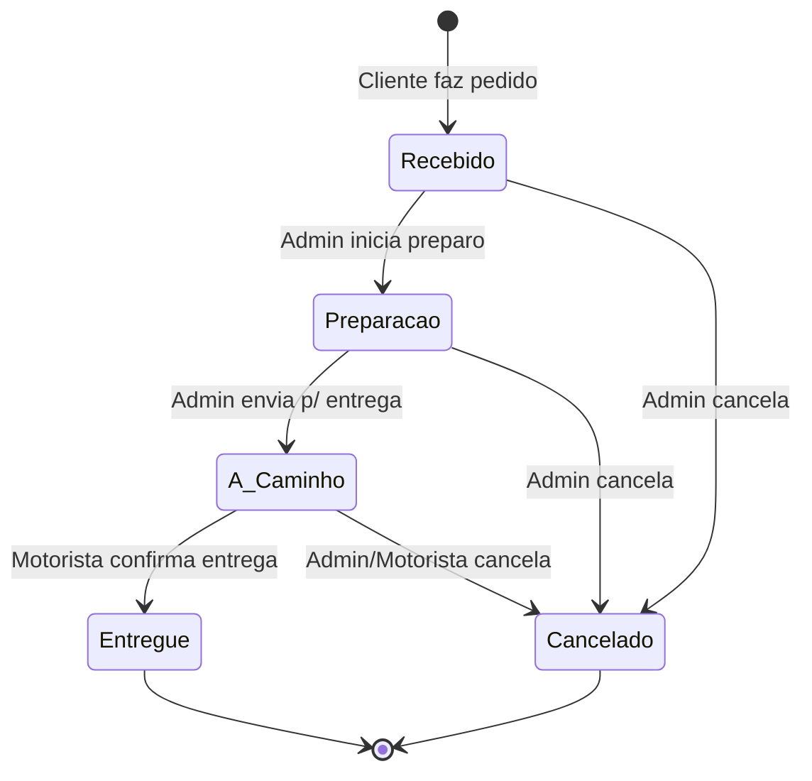

# Data Model: Order Tracking and Delivery

## Entities and Schema Design

We will use two main tables in PostgreSQL to manage order states and historical audit trails.

### 1. Table: `orders` (Existing table updated with status constraint)
Represents the customer order and its current status.

| Field Name | Type | Constraints | Description |
|---|---|---|---|
| `id` | UUID | PRIMARY KEY, DEFAULT gen_random_uuid() | Unique identifier |
| `cliente_id` | UUID | FOREIGN KEY REFERENCES `users(id)` | Customer placing the order |
| `restaurante_id` | UUID | FOREIGN KEY REFERENCES `restaurants(id)` | Restaurant fulfilling the order |
| `status` | VARCHAR(20) | NOT NULL, CHECK (status IN ('Recebido', 'Preparacao', 'A Caminho', 'Entregue', 'Cancelado')) | Current state of order |
| `valor_total` | DECIMAL(10,2) | NOT NULL | Total price |
| `data_criacao` | TIMESTAMPTZ | NOT NULL, DEFAULT NOW() | Record creation date |
| `data_atualizacao`| TIMESTAMPTZ | NOT NULL, DEFAULT NOW() | Record update date |

### 2. Table: `order_status_history`
Maintains a log of all state transitions for auditing and analytics.

| Field Name | Type | Constraints | Description |
|---|---|---|---|
| `id` | UUID | PRIMARY KEY, DEFAULT gen_random_uuid() | Unique history record ID |
| `order_id` | UUID | NOT NULL, FOREIGN KEY REFERENCES `orders(id)` ON DELETE CASCADE | Associated order |
| `status_anterior`| VARCHAR(20) | CHECK (status_anterior IN (NULL, 'Recebido', 'Preparacao', 'A Caminho', 'Entregue')) | Previous state |
| `novo_status` | VARCHAR(20) | NOT NULL, CHECK (novo_status IN ('Recebido', 'Preparacao', 'A Caminho', 'Entregue', 'Cancelado')) | State transitioned to |
| `data_alteracao` | TIMESTAMPTZ | NOT NULL, DEFAULT NOW() | Time of transition |
| `usuario_alteracao_id`| UUID | NOT NULL, FOREIGN KEY REFERENCES `users(id)` | User who triggered the change |
| `motivo_cancelamento` | TEXT | NULL | Reason if transitioned to 'Cancelado' |

---

## State Transition Validation Rules

To protect database integrity and ensure consistent tracking, the system must enforce strict transitions:

### Transition Validation Constraints
1. **Allowed Transitions**:
   - `NULL` -> `Recebido` (Initial creation)
   - `Recebido` -> `Preparacao` or `Cancelado`
   - `Preparacao` -> `A Caminho` or `Cancelado`
   - `A Caminho` -> `Entregue` or `Cancelado`
2. **Forbidden Transitions**:
   - `Recebido` -> `A Caminho` or `Entregue`
   - `Preparacao` -> `Entregue`
   - `Entregue` -> `Cancelado` (An already delivered order cannot be cancelled)
   - Any transitions out of `Entregue` or `Cancelado` (Terminal states)
